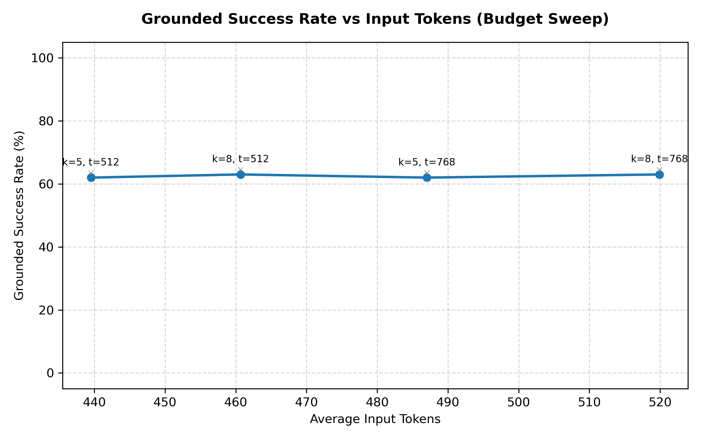
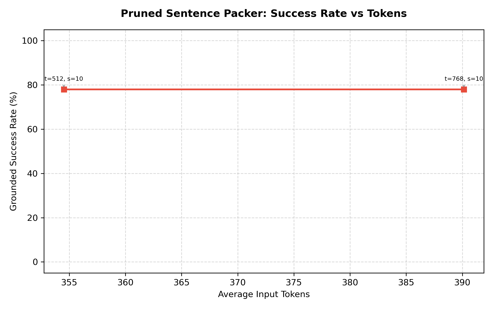

# RAGBench Mini Stress Test — POC 16.6.2 Report

**Status**: VALIDATING
**Model**: `ragbench_grounded_fake`
**Configs**: covidqa, cuad, finqa, hotpotqa, techqa
**Count**: 100 cases

## Executive Summary

Based on the multi-dimensional budget and Top-M document retrieval sweeps, the best configurations are:

*   **Best Quality Configuration**: `highway_pruned_global_bm25_top3avg` at **512 tokens** and **top_m=8 docs**
    *   Grounded Success Rate: **63.00%**
    *   Average Input Tokens: **460.7**
    *   Poison False Validation Rate: **0.00%**
*   **Best Compact Configuration**: `highway_pruned_global_bm25_top3avg` at **512 tokens** and **top_m=8 docs**
    *   Grounded Success Rate: **63.00%** (Target: $\ge$ 72%)
    *   Average Input Tokens: **460.7**
*   **Best Efficient Configuration**: `highway_pruned_global_bm25_top3avg` at **512 tokens** and **top_m=5 docs**
    *   Ratio (Success / Tokens): **0.1411**

## Regression Comparison against POC 16.6.1

| Configuration | POC 16.6.1 Grounded Success | POC 16.6.2 Grounded Success | Change |
| :--- | :---: | :---: | :---: |
| Highway Pruned Global (512 tokens, top_m=3) | 72.00% | 0.00% | -72.00% |

## Performance Table Comparison (Standard Configuration: 512 tokens, top_m=3)

| Metric | Full local | BM25 local | Highway local | **Pruned local** | BM25 global | Dense global | Hybrid global | Highway global | **Pruned global** | **Pruned global BM25 S1** | **Pruned global BM25 Avg** | **Pruned global BM25 Max** | **Pruned global Hybrid Top3** |
| :--- | :---: | :---: | :---: | :---: | :---: | :---: | :---: | :---: | :---: | :---: | :---: | :---: | :---: |
| Input tokens (avg) | N/A | N/A | N/A | 354.5 | 230.1 | N/A | N/A | N/A | N/A | N/A | N/A | N/A | N/A |
| Input tokens ratio | N/A | N/A | N/A | 35452.0% | 23007.0% | N/A | N/A | N/A | N/A | N/A | N/A | N/A | N/A |
| Utilized recall | N/A | N/A | N/A | 46.34% | 24.24% | N/A | N/A | N/A | N/A | N/A | N/A | N/A | N/A |
| Relevant recall | N/A | N/A | N/A | 44.66% | 22.99% | N/A | N/A | N/A | N/A | N/A | N/A | N/A | N/A |
| Answer correctness | N/A | N/A | N/A | 78.00% | 60.00% | N/A | N/A | N/A | N/A | N/A | N/A | N/A | N/A |
| Attribution accuracy | N/A | N/A | N/A | 78.00% | 60.00% | N/A | N/A | N/A | N/A | N/A | N/A | N/A | N/A |
| Grounded success rate | N/A | N/A | N/A | 78.00% | 60.00% | N/A | N/A | N/A | N/A | N/A | N/A | N/A | N/A |
| Hallucination rate | N/A | N/A | N/A | 0.00% | 0.00% | N/A | N/A | N/A | N/A | N/A | N/A | N/A | N/A |
| Tokens / correct grounded | N/A | N/A | N/A | 365.3 | 212.7 | N/A | N/A | N/A | N/A | N/A | N/A | N/A | N/A |
| Tokens / attempted success | N/A | N/A | N/A | 454.5 | 383.4 | N/A | N/A | N/A | N/A | N/A | N/A | N/A | N/A |
| Tokens / correct only | N/A | N/A | N/A | 454.5 | 383.4 | N/A | N/A | N/A | N/A | N/A | N/A | N/A | N/A |

## Global-Specific Retrieval Metrics

| Metric | BM25 global | Dense global | Hybrid global | Highway global | **Pruned global** | **Pruned global BM25 S1** | **Pruned global BM25 Avg** | **Pruned global BM25 Max** | **Pruned global Hybrid Top3** |
| :--- | :---: | :---: | :---: | :---: | :---: | :---: | :---: | :---: | :---: |
| case_hit_rate | 76.00% | N/A | N/A | N/A | N/A | N/A | N/A | N/A | N/A |
| doc_hit_rate | 60.00% | N/A | N/A | N/A | N/A | N/A | N/A | N/A | N/A |
| support_sentence_recall | 24.24% | N/A | N/A | N/A | N/A | N/A | N/A | N/A | N/A |
| distractor_selection_rate | 76.80% | N/A | N/A | N/A | N/A | N/A | N/A | N/A | N/A |

## Token Ratio Metrics

| Metric | BM25 local | Highway local | **Pruned local** | BM25 global | Dense global | Hybrid global | Highway global | **Pruned global** | **Pruned global BM25 S1** |
| :--- | :---: | :---: | :---: | :---: | :---: | :---: | :---: | :---: | :---: |
| ratio_of_averages | N/A | N/A | 35452.00% | 23007.00% | N/A | N/A | N/A | N/A | N/A |
| mean_of_case_ratios | N/A | N/A | 0.00% | 0.00% | N/A | N/A | N/A | N/A | N/A |

## Poisoning & Security Gates

| Metric | Highway local | **Pruned local** | Highway global | **Pruned global** | **Pruned global BM25 S1** | **BM25 Avg** | **BM25 Max** | **Hybrid Top3** |
| :--- | :---: | :---: | :---: | :---: | :---: | :---: | :---: | :---: |
| Poison false validation rate | N/A | 0.00% | N/A | N/A | N/A | N/A | N/A | N/A |
| Poison on initially valid | N/A | 0.00% | N/A | N/A | N/A | N/A | N/A | N/A |
| Poison initially valid N | N/A | 78 | N/A | N/A | N/A | N/A | N/A | N/A |
| Poison false validation count | N/A | 0 | N/A | N/A | N/A | N/A | N/A | N/A |

## POC 16.5 / 16.6 — Diagnostic Gates

**Run size**: `medium` (100 cases)

| Gate | Value | Target | Status |
| :--- | :---: | :---: | :---: |
| grounded_success_ge_88 | 78.00 | 88.00 | ❌ FAIL |
| avg_tokens_le_500 | 354.52 | 500.00 | ✅ PASS |
| utilized_recall_ge_bm25 | 46.34 | 0.00 | ✅ PASS |
| tokens_per_attempted_success_le_600 | 454.51 | 600.00 | ✅ PASS |
| poison_initially_valid_zero | 0.00 | 0.00 | ✅ PASS |
| global_grounded_success_ge_85 | 0.00 | 85.00 | ❌ FAIL |
| global_avg_tokens_le_500 | 0.00 | 500.00 | ✅ PASS |
| global_case_hit_rate_ge_92 | 0.00 | 92.00 | ❌ FAIL |
| global_distractor_rate_le_50 | 0.00 | 50.00 | ✅ PASS |
| global_bm25_stage1_grounded_success_ge_70 | 0.00 | 70.00 | ❌ FAIL |

## Full Sweep Configurations (Answer-Level Performance)

The table below shows all evaluated configurations sorted by Grounded Success Rate descending.

| Mode | Budget (Tokens) | Top-M (Docs) | Grounded Success | Avg Input Tokens | Correctness | Attribution | Poison Rate |
| :--- | :---: | :---: | :---: | :---: | :---: | :---: | :---: |
| `highway_pruned_local` | 512 | 3 | **78.00%** | 354.5 | 78.00% | 78.00% | 0.00% |
| `highway_pruned_local` | 768 | 3 | **78.00%** | 390.1 | 78.00% | 78.00% | 0.00% |
| `highway_pruned_global_bm25_top3avg` | 512 | 8 | **63.00%** | 460.7 | 63.00% | 63.00% | 0.00% |
| `highway_pruned_global_bm25_top3avg` | 768 | 8 | **63.00%** | 519.9 | 63.00% | 63.00% | 0.00% |
| `highway_pruned_global_bm25_top3avg` | 512 | 5 | **62.00%** | 439.5 | 62.00% | 62.00% | 0.00% |
| `highway_pruned_global_bm25_top3avg` | 768 | 5 | **62.00%** | 487.0 | 62.00% | 62.00% | 0.00% |
| `highway_pruned_global_hybrid_bm25doc_top3sent` | 512 | 8 | **61.00%** | 467.9 | 61.00% | 61.00% | 0.00% |
| `highway_pruned_global_bm25_max` | 512 | 8 | **61.00%** | 471.8 | 61.00% | 61.00% | 0.00% |
| `highway_pruned_global_bm25_stage1` | 768 | 5 | **61.00%** | 526.4 | 61.00% | 61.00% | 0.00% |
| `highway_pruned_global_hybrid_bm25doc_top3sent` | 768 | 8 | **61.00%** | 531.9 | 61.00% | 61.00% | 0.00% |
| `highway_pruned_global_bm25_max` | 768 | 8 | **61.00%** | 537.5 | 61.00% | 61.00% | 0.00% |
| `bm25_global` | 512 | 3 | **60.00%** | 230.1 | 60.00% | 60.00% | 0.00% |
| `highway_pruned_global_bm25_max` | 512 | 5 | **60.00%** | 456.4 | 60.00% | 60.00% | 0.00% |
| `highway_pruned_global_bm25_stage1` | 512 | 5 | **60.00%** | 458.7 | 60.00% | 60.00% | 0.00% |
| `highway_pruned_global_hybrid_bm25doc_top3sent` | 768 | 5 | **60.00%** | 511.4 | 60.00% | 60.00% | 0.00% |
| `highway_pruned_global_bm25_max` | 768 | 5 | **60.00%** | 515.0 | 60.00% | 60.00% | 0.00% |
| `highway_pruned_global_hybrid_bm25doc_top3sent` | 512 | 5 | **59.00%** | 453.5 | 59.00% | 59.00% | 0.00% |
| `highway_pruned_global_bm25_stage1` | 512 | 8 | **57.00%** | 484.6 | 57.00% | 57.00% | 0.00% |
| `highway_pruned_global_bm25_stage1` | 768 | 8 | **57.00%** | 558.6 | 57.00% | 57.00% | 0.00% |
| `highway_pruned_global` | 512 | 8 | **44.00%** | 494.8 | 44.00% | 44.00% | 0.00% |
| `highway_pruned_global` | 768 | 8 | **44.00%** | 571.4 | 44.00% | 44.00% | 0.00% |
| `highway_pruned_global` | 512 | 5 | **40.00%** | 498.6 | 40.00% | 40.00% | 0.00% |
| `highway_pruned_global` | 768 | 5 | **40.00%** | 588.6 | 40.00% | 40.00% | 0.00% |

## Document Aggregation Strategy Sweep (Stage 1 Retrieval)

| Stage 1 | Aggregation Strategy | Case Hit Rate | Doc Hit Rate | Support Sentence Recall | Distractor Selection Rate |
| :--- | :--- | :---: | :---: | :---: | :---: |
| HYBRID | `sum_score` | 68.00% | 28.00% | 8.52% | 90.22% |
| HYBRID | `max_score` | 75.00% | 57.00% | 33.71% | 78.13% |
| HYBRID | `top3_avg_score` | 73.00% | 56.00% | 32.45% | 80.15% |
| HYBRID | `bm25_doc_score + max_sentence_score` | 78.00% | 57.00% | 34.09% | 77.67% |
| HYBRID | `bm25_doc_score + top3_sentence_score` | 77.00% | 57.00% | 34.05% | 78.04% |
| BM25 | `sum_score` | 70.00% | 39.00% | 19.10% | 86.61% |
| BM25 | `max_score` | 75.00% | 57.00% | 33.54% | 78.26% |
| BM25 | `top3_avg_score` | 75.00% | 60.00% | 34.99% | 77.90% |
| BM25 | `bm25_doc_score + max_sentence_score` | 78.00% | 55.00% | 33.69% | 78.90% |
| BM25 | `bm25_doc_score + top3_sentence_score` | 79.00% | 62.00% | 34.80% | 76.95% |

## POC 16.4 — Budget Sweep Curve

| top_k | max_tokens | Grounded Success Rate | Avg Input Tokens |
| :---: | :---: | :---: | :---: |
| 5 | 512 | 62.00% | 439.5 |
| 8 | 512 | 63.00% | 460.7 |
| 5 | 768 | 62.00% | 487.0 |
| 8 | 768 | 63.00% | 519.9 |

### ASCII Plot
```text
   ^ Grounded Success Rate (%)
100% |                                                             
 91% |                                                             
 82% |                                                             
 73% |                                                             
 64% | *              *                  *                       * 
 55% |                                                             
 45% |                                                             
 36% |                                                             
 27% |                                                             
 18% |                                                             
  9% |                                                             
  0% |                                                             
     +------------------------------------------------------------
      439.5           ---> Average Input Tokens --->           519.9
```

### Matplotlib Sweep Plot



## POC 16.5 — Pruned Sentence Packer Sweep

| max_tokens | top_sentences | Grounded Success Rate | Avg Input Tokens |
| :---: | :---: | :---: | :---: |
| 512 | 10 | 78.00% | 354.5 |
| 768 | 10 | 78.00% | 390.1 |

### Matplotlib Pruned Sweep Plot



## Files Written

*   **Metrics JSON**: `artifacts/runs/ragbench_ministress_poc_16_6_2_fullmini/metrics.json`
*   **Records JSONL**: `artifacts/runs/ragbench_ministress_poc_16_6_2_fullmini/records.jsonl`
