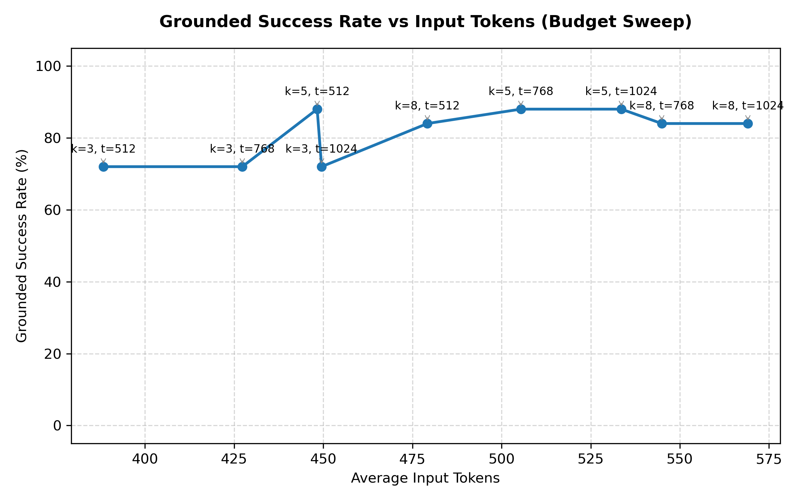

# RAGBench Mini Stress Test — POC 16.6.2 Report

**Status**: VALIDATING
**Model**: `ragbench_grounded_fake`
**Configs**: covidqa, cuad, finqa, hotpotqa, techqa
**Count**: 25 cases

## Executive Summary

Based on the multi-dimensional budget and Top-M document retrieval sweeps, the best configurations are:

*   **Best Quality Configuration**: `highway_pruned_global_hybrid_bm25doc_top3sent` at **512 tokens** and **top_m=5 docs**
    *   Grounded Success Rate: **88.00%**
    *   Average Input Tokens: **440.0**
    *   Poison False Validation Rate: **0.00%**
*   **Best Compact Configuration**: `highway_pruned_global_bm25_top3avg` at **512 tokens** and **top_m=3 docs**
    *   Grounded Success Rate: **80.00%** (Target: $\ge$ 72%)
    *   Average Input Tokens: **381.2**
*   **Best Efficient Configuration**: `highway_pruned_global_bm25_top3avg` at **512 tokens** and **top_m=3 docs**
    *   Ratio (Success / Tokens): **0.2099**

## Regression Comparison against POC 16.6.1

| Configuration | POC 16.6.1 Grounded Success | POC 16.6.2 Grounded Success | Change |
| :--- | :---: | :---: | :---: |
| Highway Pruned Global (512 tokens, top_m=3) | 72.00% | 0.00% | -72.00% |

## Performance Table Comparison (Standard Configuration: 512 tokens, top_m=3)

| Metric | Full local | BM25 local | Highway local | **Pruned local** | BM25 global | Dense global | Hybrid global | Highway global | **Pruned global** | **Pruned global BM25 S1** | **Pruned global BM25 Avg** | **Pruned global BM25 Max** | **Pruned global Hybrid Top3** |
| :--- | :---: | :---: | :---: | :---: | :---: | :---: | :---: | :---: | :---: | :---: | :---: | :---: | :---: |
| Input tokens (avg) | N/A | N/A | N/A | N/A | 225.4 | N/A | 208.5 | N/A | N/A | 388.3 | 381.2 | 391.8 | 407.6 |
| Input tokens ratio | N/A | N/A | N/A | N/A | 22540.0% | N/A | 20848.0% | N/A | N/A | 38832.0% | 38116.0% | 39180.0% | 40764.0% |
| Utilized recall | N/A | N/A | N/A | N/A | 19.00% | N/A | 16.33% | N/A | N/A | 40.27% | 40.93% | 38.93% | 44.93% |
| Relevant recall | N/A | N/A | N/A | N/A | 21.08% | N/A | 17.95% | N/A | N/A | 40.49% | 42.21% | 40.21% | 43.73% |
| Answer correctness | N/A | N/A | N/A | N/A | 76.00% | N/A | 72.00% | N/A | N/A | 72.00% | 80.00% | 80.00% | 80.00% |
| Attribution accuracy | N/A | N/A | N/A | N/A | 76.00% | N/A | 72.00% | N/A | N/A | 72.00% | 80.00% | 80.00% | 80.00% |
| Grounded success rate | N/A | N/A | N/A | N/A | 76.00% | N/A | 72.00% | N/A | N/A | 72.00% | 80.00% | 80.00% | 80.00% |
| Hallucination rate | N/A | N/A | N/A | N/A | 0.00% | N/A | 0.00% | N/A | N/A | 0.00% | 0.00% | 0.00% | 0.00% |
| Tokens / correct grounded | N/A | N/A | N/A | N/A | 207.9 | N/A | 192.6 | N/A | N/A | 373.0 | 366.1 | 361.8 | 376.3 |
| Tokens / attempted success | N/A | N/A | N/A | N/A | 296.6 | N/A | 289.6 | N/A | N/A | 539.3 | 476.4 | 489.8 | 509.6 |
| Tokens / correct only | N/A | N/A | N/A | N/A | 296.6 | N/A | 289.6 | N/A | N/A | 539.3 | 476.4 | 489.8 | 509.6 |

## Global-Specific Retrieval Metrics

| Metric | BM25 global | Dense global | Hybrid global | Highway global | **Pruned global** | **Pruned global BM25 S1** | **Pruned global BM25 Avg** | **Pruned global BM25 Max** | **Pruned global Hybrid Top3** |
| :--- | :---: | :---: | :---: | :---: | :---: | :---: | :---: | :---: | :---: |
| case_hit_rate | 92.00% | N/A | 92.00% | N/A | N/A | 92.00% | 92.00% | 92.00% | 92.00% |
| doc_hit_rate | 76.00% | N/A | 72.00% | N/A | N/A | 72.00% | 80.00% | 80.00% | 80.00% |
| support_sentence_recall | 19.00% | N/A | 16.33% | N/A | N/A | 40.27% | 40.93% | 38.93% | 44.93% |
| distractor_selection_rate | 68.00% | N/A | 74.40% | N/A | N/A | 72.63% | 70.49% | 70.38% | 70.27% |

## Token Ratio Metrics

| Metric | BM25 local | Highway local | **Pruned local** | BM25 global | Dense global | Hybrid global | Highway global | **Pruned global** | **Pruned global BM25 S1** |
| :--- | :---: | :---: | :---: | :---: | :---: | :---: | :---: | :---: | :---: |
| ratio_of_averages | N/A | N/A | N/A | 22540.00% | N/A | 20848.00% | N/A | N/A | 38832.00% |
| mean_of_case_ratios | N/A | N/A | N/A | 0.00% | N/A | 0.00% | N/A | N/A | 0.00% |

## Poisoning & Security Gates

| Metric | Highway local | **Pruned local** | Highway global | **Pruned global** | **Pruned global BM25 S1** | **BM25 Avg** | **BM25 Max** | **Hybrid Top3** |
| :--- | :---: | :---: | :---: | :---: | :---: | :---: | :---: | :---: |
| Poison false validation rate | N/A | N/A | N/A | N/A | 0.00% | 0.00% | 0.00% | 0.00% |
| Poison on initially valid | N/A | N/A | N/A | N/A | 0.00% | 0.00% | 0.00% | 0.00% |
| Poison initially valid N | N/A | N/A | N/A | N/A | 18 | 20 | 20 | 20 |
| Poison false validation count | N/A | N/A | N/A | N/A | 0 | 0 | 0 | 0 |

## POC 16.5 / 16.6 — Diagnostic Gates

**Run size**: `smoke` (25 cases)

| Gate | Value | Target | Status |
| :--- | :---: | :---: | :---: |
| grounded_success_ge_88 | 0.00 | 88.00 | ❌ FAIL |
| avg_tokens_le_500 | 0.00 | 500.00 | ✅ PASS |
| utilized_recall_ge_bm25 | 0.00 | 0.00 | ✅ PASS |
| tokens_per_attempted_success_le_600 | 0.00 | 600.00 | ✅ PASS |
| poison_initially_valid_zero | 0.00 | 0.00 | ✅ PASS |
| global_grounded_success_ge_85 | 0.00 | 85.00 | ❌ FAIL |
| global_avg_tokens_le_500 | 0.00 | 500.00 | ✅ PASS |
| global_case_hit_rate_ge_92 | 0.00 | 92.00 | ❌ FAIL |
| global_distractor_rate_le_50 | 0.00 | 50.00 | ✅ PASS |
| global_bm25_stage1_grounded_success_ge_70 | 72.00 | 70.00 | ✅ PASS |

## Full Sweep Configurations (Answer-Level Performance)

The table below shows all evaluated configurations sorted by Grounded Success Rate descending.

| Mode | Budget (Tokens) | Top-M (Docs) | Grounded Success | Avg Input Tokens | Correctness | Attribution | Poison Rate |
| :--- | :---: | :---: | :---: | :---: | :---: | :---: | :---: |
| `highway_pruned_global_hybrid_bm25doc_top3sent` | 512 | 5 | **88.00%** | 440.0 | 88.00% | 88.00% | 0.00% |
| `highway_pruned_global_bm25_stage1` | 512 | 5 | **88.00%** | 448.3 | 88.00% | 88.00% | 0.00% |
| `highway_pruned_global_hybrid_bm25doc_top3sent` | 768 | 5 | **88.00%** | 495.3 | 88.00% | 88.00% | 0.00% |
| `highway_pruned_global_bm25_stage1` | 768 | 5 | **88.00%** | 505.4 | 88.00% | 88.00% | 0.00% |
| `highway_pruned_global_hybrid_bm25doc_top3sent` | 1024 | 5 | **88.00%** | 515.9 | 88.00% | 88.00% | 0.00% |
| `highway_pruned_global_bm25_stage1` | 1024 | 5 | **88.00%** | 533.6 | 88.00% | 88.00% | 0.00% |
| `highway_pruned_global_bm25_max` | 512 | 5 | **84.00%** | 426.4 | 84.00% | 84.00% | 0.00% |
| `highway_pruned_global_bm25_top3avg` | 512 | 8 | **84.00%** | 465.8 | 84.00% | 84.00% | 0.00% |
| `highway_pruned_global_bm25_stage1` | 512 | 8 | **84.00%** | 479.2 | 84.00% | 84.00% | 0.00% |
| `highway_pruned_global_bm25_max` | 768 | 5 | **84.00%** | 480.3 | 84.00% | 84.00% | 0.00% |
| `highway_pruned_global_bm25_max` | 1024 | 5 | **84.00%** | 493.2 | 84.00% | 84.00% | 0.00% |
| `highway_pruned_global_bm25_top3avg` | 768 | 8 | **84.00%** | 514.0 | 84.00% | 84.00% | 0.00% |
| `highway_pruned_global_bm25_top3avg` | 1024 | 8 | **84.00%** | 523.1 | 84.00% | 84.00% | 0.00% |
| `highway_pruned_global_bm25_stage1` | 768 | 8 | **84.00%** | 544.9 | 84.00% | 84.00% | 0.00% |
| `highway_pruned_global_bm25_stage1` | 1024 | 8 | **84.00%** | 569.1 | 84.00% | 84.00% | 0.00% |
| `highway_pruned_global_bm25_top3avg` | 512 | 3 | **80.00%** | 381.2 | 80.00% | 80.00% | 0.00% |
| `highway_pruned_global_bm25_max` | 512 | 3 | **80.00%** | 391.8 | 80.00% | 80.00% | 0.00% |
| `highway_pruned_global_hybrid_bm25doc_top3sent` | 512 | 3 | **80.00%** | 407.6 | 80.00% | 80.00% | 0.00% |
| `highway_pruned_global_bm25_top3avg` | 512 | 5 | **80.00%** | 416.5 | 80.00% | 80.00% | 0.00% |
| `highway_pruned_global_bm25_top3avg` | 768 | 3 | **80.00%** | 422.9 | 80.00% | 80.00% | 0.00% |
| `highway_pruned_global_bm25_max` | 768 | 3 | **80.00%** | 428.5 | 80.00% | 80.00% | 0.00% |
| `highway_pruned_global_hybrid_bm25doc_top3sent` | 768 | 3 | **80.00%** | 448.5 | 80.00% | 80.00% | 0.00% |
| `highway_pruned_global_bm25_top3avg` | 1024 | 3 | **80.00%** | 449.2 | 80.00% | 80.00% | 0.00% |
| `highway_pruned_global_hybrid_bm25doc_top3sent` | 512 | 8 | **80.00%** | 452.6 | 80.00% | 80.00% | 0.00% |
| `highway_pruned_global_bm25_max` | 1024 | 3 | **80.00%** | 453.8 | 80.00% | 80.00% | 0.00% |
| `highway_pruned_global_bm25_max` | 512 | 8 | **80.00%** | 463.2 | 80.00% | 80.00% | 0.00% |
| `highway_pruned_global_bm25_top3avg` | 768 | 5 | **80.00%** | 464.2 | 80.00% | 80.00% | 0.00% |
| `highway_pruned_global_hybrid_bm25doc_top3sent` | 1024 | 3 | **80.00%** | 472.0 | 80.00% | 80.00% | 0.00% |
| `highway_pruned_global_bm25_top3avg` | 1024 | 5 | **80.00%** | 480.4 | 80.00% | 80.00% | 0.00% |
| `highway_pruned_global_hybrid_bm25doc_top3sent` | 768 | 8 | **80.00%** | 514.4 | 80.00% | 80.00% | 0.00% |
| `highway_pruned_global_hybrid_bm25doc_top3sent` | 1024 | 8 | **80.00%** | 524.9 | 80.00% | 80.00% | 0.00% |
| `highway_pruned_global_bm25_max` | 768 | 8 | **80.00%** | 526.5 | 80.00% | 80.00% | 0.00% |
| `highway_pruned_global_bm25_max` | 1024 | 8 | **80.00%** | 541.2 | 80.00% | 80.00% | 0.00% |
| `bm25_global` | 512 | 3 | **76.00%** | 225.4 | 76.00% | 76.00% | 0.00% |
| `hybrid_global` | 512 | 3 | **72.00%** | 208.5 | 72.00% | 72.00% | 0.00% |
| `highway_pruned_global_bm25_stage1` | 512 | 3 | **72.00%** | 388.3 | 72.00% | 72.00% | 0.00% |
| `highway_pruned_global_bm25_stage1` | 768 | 3 | **72.00%** | 427.3 | 72.00% | 72.00% | 0.00% |
| `highway_pruned_global_bm25_stage1` | 1024 | 3 | **72.00%** | 449.5 | 72.00% | 72.00% | 0.00% |

## Document Aggregation Strategy Sweep (Stage 1 Retrieval)

| Stage 1 | Aggregation Strategy | Case Hit Rate | Doc Hit Rate | Support Sentence Recall | Distractor Selection Rate |
| :--- | :--- | :---: | :---: | :---: | :---: |
| HYBRID | `sum_score` | 56.00% | 28.00% | 3.60% | 89.53% |
| HYBRID | `max_score` | 92.00% | 80.00% | 36.93% | 71.97% |
| HYBRID | `top3_avg_score` | 92.00% | 80.00% | 34.93% | 73.24% |
| HYBRID | `bm25_doc_score + max_sentence_score` | 92.00% | 76.00% | 40.93% | 70.56% |
| HYBRID | `bm25_doc_score + top3_sentence_score` | 92.00% | 80.00% | 44.93% | 70.27% |
| BM25 | `sum_score` | 92.00% | 56.00% | 15.27% | 80.29% |
| BM25 | `max_score` | 92.00% | 80.00% | 38.93% | 70.38% |
| BM25 | `top3_avg_score` | 92.00% | 80.00% | 40.93% | 70.49% |
| BM25 | `bm25_doc_score + max_sentence_score` | 92.00% | 72.00% | 40.27% | 72.63% |
| BM25 | `bm25_doc_score + top3_sentence_score` | 92.00% | 76.00% | 42.27% | 70.03% |

## POC 16.4 — Budget Sweep Curve

| top_k | max_tokens | Grounded Success Rate | Avg Input Tokens |
| :---: | :---: | :---: | :---: |
| 3 | 512 | 72.00% | 388.3 |
| 5 | 512 | 88.00% | 448.3 |
| 8 | 512 | 84.00% | 479.2 |
| 3 | 768 | 72.00% | 427.3 |
| 5 | 768 | 88.00% | 505.4 |
| 8 | 768 | 84.00% | 544.9 |
| 3 | 1024 | 72.00% | 449.5 |
| 5 | 1024 | 88.00% | 533.6 |
| 8 | 1024 | 84.00% | 569.1 |

### ASCII Plot
```text
   ^ Grounded Success Rate (%)
100% |                                                             
 91% |                    *         *        *        *   *      * 
 82% |                                                             
 73% | *           *      *                                        
 64% |                                                             
 55% |                                                             
 45% |                                                             
 36% |                                                             
 27% |                                                             
 18% |                                                             
  9% |                                                             
  0% |                                                             
     +------------------------------------------------------------
      388.3           ---> Average Input Tokens --->           569.1
```

### Matplotlib Sweep Plot



## Files Written

*   **Metrics JSON**: `artifacts/runs/ragbench_ministress_poc_16_6_2_smoke/metrics.json`
*   **Records JSONL**: `artifacts/runs/ragbench_ministress_poc_16_6_2_smoke/records.jsonl`
